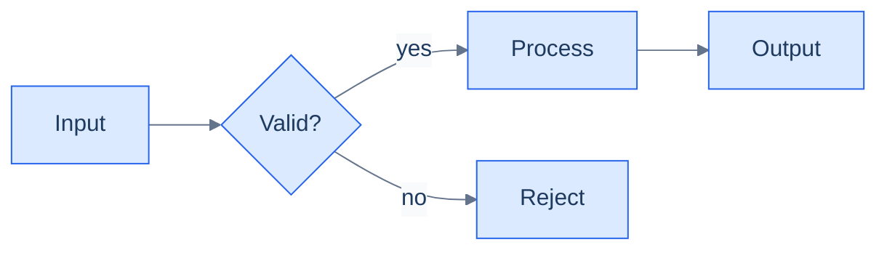
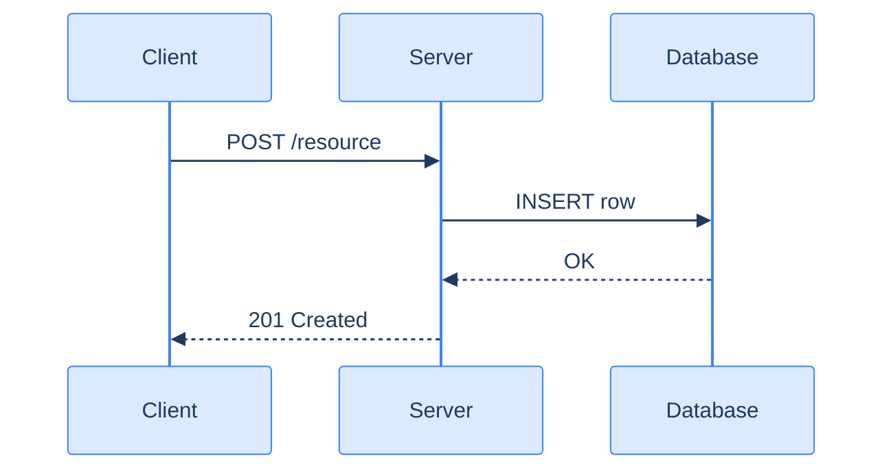
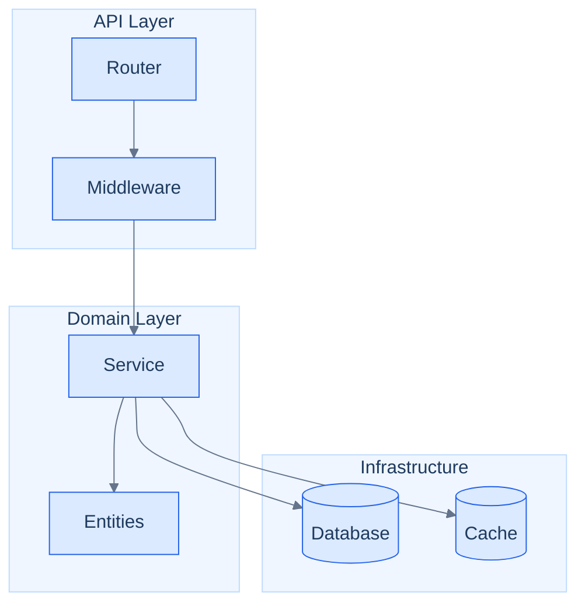
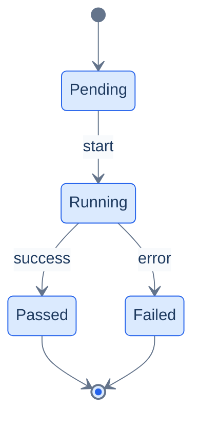

# Mermaid Diagramming

Produce Mermaid diagrams that use the project's blue-gray theme. Every diagram must include the theme init directive as its first line.

## Theme Directive

Paste this as the **first line** inside every ```` ```mermaid ```` block, before the diagram type declaration:

```
%%{init: {'theme': 'base', 'themeVariables': {'primaryColor': '#dbeafe', 'primaryTextColor': '#1e3a5f', 'primaryBorderColor': '#3b82f6', 'lineColor': '#64748b', 'secondaryColor': '#f1f5f9', 'tertiaryColor': '#e0f2fe', 'background': '#ffffff', 'mainBkg': '#dbeafe', 'nodeBorder': '#2563eb', 'clusterBkg': '#eff6ff', 'clusterBorder': '#bfdbfe', 'titleColor': '#1e3a5f', 'edgeLabelBackground': '#f8fafc'}}}%%
```

### Palette reference

| Variable | Value | Role |
|---|---|---|
| `primaryColor` / `mainBkg` | `#dbeafe` (blue-100) | Default node fill |
| `secondaryColor` | `#f1f5f9` (slate-100) | Secondary node fill |
| `tertiaryColor` | `#e0f2fe` (sky-100) | Tertiary / highlight fill |
| `primaryBorderColor` / `nodeBorder` | `#3b82f6` / `#2563eb` (blue-500/600) | Node border |
| `clusterBkg` | `#eff6ff` (blue-50) | Subgraph / cluster fill |
| `clusterBorder` | `#bfdbfe` (blue-200) | Subgraph border |
| `lineColor` | `#64748b` (slate-500) | Edge / arrow color |
| `primaryTextColor` / `titleColor` | `#1e3a5f` (dark navy) | Text |
| `edgeLabelBackground` | `#f8fafc` (slate-50) | Edge label background |
| `background` | `#ffffff` | Diagram background |

## Rules

1. **Always include the theme directive.** No exceptions — every ```` ```mermaid ```` block in this repo starts with the `%%{init}%%` line.
2. **One diagram per concept.** If a section needs multiple views, use separate fenced blocks with a heading for each.
3. **Keep labels short.** Node labels ≤ 6 words. Use subgraphs for grouping, not long labels.
4. **Decision nodes use `{...}` rhombus shape.** Action nodes use `[...]` rectangles. Terminal/IO nodes use `[/..../]` parallelograms.
5. **Left-to-right for pipelines, top-to-bottom for hierarchies.** Default to `LR` for data flow; `TD` for org charts, call trees, and phase sequences.

## Diagram Types

### Flowchart — processes and pipelines



### Sequence — interactions between actors/services



### Graph with subgraphs — architecture layers



### State diagram — lifecycle / state machine



## Procedure

1. Identify the diagram type that best fits the concept (flowchart, sequence, state, ER, etc.).
2. Draft the structure — nodes, edges, labels — before writing Mermaid syntax.
3. Open the ```` ```mermaid ```` block with the theme `%%{init}%%` directive on line 1.
4. Write the diagram type declaration on line 2.
5. Verify the diagram is syntactically valid (balanced brackets, no duplicate node IDs).
6. Add the diagram to the markdown file with a heading that explains what it shows.

## Adding a diagram to an existing file

When inserting a diagram into an existing markdown file:

1. Read the file first to understand the document structure and find the right insertion point.
2. Use a second-level heading (`##`) above the diagram block to name the concept.
3. Add a one-sentence caption below the closing ```` ``` ```` that describes what the diagram shows — this doubles as alt-text.
