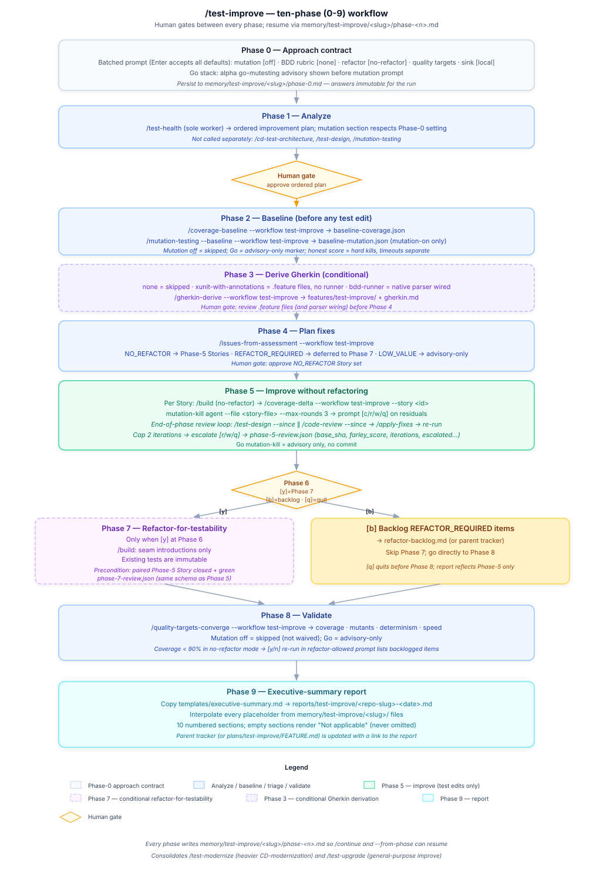

# Architecture

> **Reading order**: Start with the System Overview flowchart, then read Context Management to understand how agents are loaded and unloaded, followed by Quality Assurance for the validation sequence during Phase 3.

**On this page:** [System Overview](#system-overview) · [Three-phase workflow](#three-phase-workflow) · [Model Routing](#model-routing) · [Knowledge Index](#knowledge-index) · [Review-Fix Loop](#review-fix-loop) · [Test improvement workflow](#test-improvement-workflow-test-improve) · [Context Management](#context-management) · [Plan Review Personas](#plan-review-personas) · [Quality Assurance](#quality-assurance) · [Human Oversight](#human-oversight) · [Governance](#governance) · [Feedback Loop](#feedback-loop) · [Performance Targets](#performance-targets)

## System Overview

The Orchestrator receives every request, classifies it by type and complexity, selects agents, assigns models, and coordinates delivery. During Phase 3 (Implement), review agents check coding agent output at each discrete unit-of-work checkpoint. Findings feed back as structured corrections (max 2 cycles before human escalation). After each task, the learning loop captures metrics and evaluates whether configuration updates are needed.

## Three-phase workflow

Feature work flows through three phases — **Research → Plan → Implement** — with a human gate between each. Research turns a request into approved specs (`/specs` produces Intent, Architecture, and Acceptance Criteria) plus a design doc; Plan decomposes them into vertical slices, authors each slice's Gherkin scenarios, and lays out the TDD steps, which up to five critic personas (Acceptance, Design, UX, Strategic, Parallelization — the set scales to plan tier) challenge before the human approves; Implement runs the per-behavior build loop — Code-First Small Batches (IMPLEMENT → TEST → REFACTOR), the sole build cadence — with a three-stage inline review (spec-compliance, quality agents, and browser verification for UI changes) and a `/code-review` gate, then opens the PR and feeds the learning loop.

## Model Routing

Each agent declares `model:` (an alias, a full model ID, or `inherit`) and `effort:` (`low|medium|high|xhigh|max`) directly in its frontmatter — the native Claude Code sub-agent contract, resolved by the harness itself before dispatch. There is no plugin-side resolution hook, routing map, or per-environment ladder file (ADR 0026 retired that machinery once the native fields were confirmed to already provide it). See `agents/orchestrator.md` → Model/Effort Resolution.

## Knowledge Index

`knowledge/index.json` is a deterministic, checked-in catalog of every H2/H3 section across `knowledge/**.md` and `skills/**/SKILL.md`. Each entry has a one-sentence summary and a slugified GitHub-style anchor. Agents that reference knowledge files cite an anchor (e.g. `knowledge/owasp-detection.md#a03-injection`) and read only the relevant section via `offset`/`limit`. Four freshness gates keep the index current: (1) PostToolUse hook auto-regen on save, (2) pre-commit sibling hook blocks stale commits, (3) `tests/repo/test_knowledge_index_current.py` runs in CI, (4) `tests/agents/test_agent_knowledge_anchor.py` validates every reference resolves. See `agents/orchestrator.md` → Knowledge index — consumer usage pattern for the canonical lookup flow, and `hooks/lib/build_knowledge_index.py --check` for ad-hoc verification.

## Review-Fix Loop

Both inline review checkpoints (Phase 3) and `/code-review` use the same review-fix loop: targeted agents run in parallel, actionable issues (error/warning severity with high/medium confidence) are auto-fixed, and only the agents that reported issues are re-run against the modified files. The loop converges in up to 5 iterations or escalates to a human. `/code-review` is the final gate before commit.

For the full pipeline — targeting, pre-flight gates, static analysis pre-pass, ACCEPTED-RISKS suppression, fix-loop exit conditions, report generation, and the `.review-passed` gate file — see [Code Review Process](code-review-process.md).

## Test improvement workflow (`/test-improve`)

`/test-improve` is the **consolidated** analyze-then-improve orchestrator for legacy or in-flight test suites. It defaults to lightweight ceremony, prompts for heavier capabilities on demand, and always baselines coverage (and mutation, when enabled) before any test change.

It runs ten phases (0-9) with a human gate between each, every phase writing a progress file at `.claude/memory/test-improve/<slug>/phase-<n>.md` so `/continue` (and `--from-phase`) can resume. The full phase-by-phase reference — gates, arguments, and the flow diagram — lives on its own page: **[test-improve.md](test-improve.md)**.

## Context Management

The Orchestrator manages context utilization using two operational skills.

### Loading Protocol

[Context Loading Protocol](../skills/context-loading-protocol/SKILL.md) controls what gets loaded and when:

1. **Classify** the task (simple, standard, multi-agent, complex)
2. **Select** the minimum set of agents and skills required
3. **Load in phases**: primary agent first, supporting agents as their phase begins
4. **Unload** previous-phase agents via summarization before loading next-phase agents

### Summarization

[Handoff](../skills/handoff/SKILL.md) (continue mode) controls when to compress:

| Utilization | Action |
| --- | --- |
| < 40% | Normal operation |
| 40-50% | Prepare for summarization |
| 50-60% | Summarize older conversation turns |
| 60-75% | Aggressive summarization |
| 75%+ | Write summary to `.claude/memory/`, start new conversation |

Utilization is estimated via proxy signals (tool call volume, message count, accumulated file reads) as described in the Context Loading Protocol. Summaries follow a structured template and are stored in `.claude/memory/` for cross-session continuity.

### Token Budgets

| Component | ~Tokens |
| --- | --- |
| CLAUDE.md (always loaded) | ~800 |
| Single team agent | 290-560 |
| Single skill | 420-1,020 |
| All team agents (no skills) | ~3,590 |
| All review agents | ~3,100 (sub-agents, not loaded in parent context) |
| Knowledge files | ~3,450 (loaded on demand by agents) |
| Plan review persona agents | ~1,800 (loaded by orchestrator when dispatching) |
| Full load (all team agents + all skills) | ~18,100 |

A typical task loads 1 agent + 1-2 skills: roughly 1,000-2,000 tokens of configuration overhead. Review agents and plan review personas run as isolated sub-agents — their context burden does not accumulate in the parent.

## Plan Review Personas

Before the human reviews a plan (Phase 2), a tier-scaled set of critical review personas runs **in parallel** as sub-agents. The reviewer set scales to a **plan tier** (`trivial`/`standard`/`complex`, derived from slice count, file count, per-step complexity, and whether the plan takes a stance on any high-reversal-cost decision axis) so a one-function plan does not pay a complex feature's review ceremony: `trivial` runs the Acceptance Test Critic alone, `standard` adds the Design & Architecture Critic (plus the UX Critic for user-facing plans and the Parallelization Critic when the slice count > 1), and `complex` runs all five. The Acceptance Test Critic always runs; the Parallelization Critic runs only when slice count > 1. Each persona challenges the plan from a distinct perspective:

| Persona | Agent | What It Challenges |
| --- | --- | --- |
| Acceptance Test Critic | `agents/plan-review-acceptance.md` | Per-slice Gherkin quality (determinism, isolation, completeness), criteria verifiability, error-path coverage, TDD step traceability |
| Design & Architecture Critic | `agents/plan-review-design.md` | Dependency direction, abstraction quality, structural risks, pattern consistency |
| Parallelization Critic | `agents/plan-review-parallelization.md` | Same-wave independence: file-overlap collisions (plan_waves.py), disjoint-file behavioral coupling, residual cycles |
| Strategic Critic | `agents/plan-review-strategic.md` | Problem-solution fit, scope assessment, risk analysis, opportunity cost |
| UX Critic | `agents/plan-review-ux.md` | User journey, error experience, cognitive load, accessibility (self-skips for non-UI plans) |

Each persona is a registered agent, dispatched by `subagent_type` like any other agent — `/plan` step 5b no longer needs a dispatch-time `model:` override; the harness reads each persona's own `model:`/`effort:` frontmatter natively.

Each reviewer returns a structured `approve` or `needs-revision` verdict. If any reviewer flags blockers, the plan is revised before the human sees it (max 2 iterations). Warnings from the dispatched reviewers are aggregated into a Plan Review Summary appended to the plan file, which also records the chosen tier and reviewer set so the scaling decision is auditable.

This gate catches problems when they cost minutes to fix (in a plan), not hours (in code).

## Quality Assurance

Validation happens in this sequence during Phase 3:

| Order | Layer | Who | When |
| --- | --- | --- | --- |
| 1 | Self-validation | Active agent | Before delivering any unit of work |
| 2 | Inline review checkpoint | Targeted review agents | After each discrete unit of work |
| 3 | Review feedback correction | Coding agent | Up to 2 correction cycles per checkpoint |
| 4 | Final code review | `/code-review` | Before committing; auto-scopes to uncommitted changes, runs full agent suite with fix loop |
| 5 | Documentation review | Tech-writer | After code review passes; verifies docs reflect current behavior |
| 6 | Peer validation | QA agent | After implementation, before phase delivery |
| 7 | Human gate | User | At each phase transition (Research, Plan, Implement) |
| 8 | Post-hoc monitoring | Orchestrator | During learning loop after task completion |

Every agent applies the [Quality Gate Pipeline](../skills/quality-gate-pipeline/SKILL.md) before output. This includes self-validation (Phase 1: factual accuracy, instruction fidelity, consistency, confidence scoring), verification evidence (Phase 2), and review-correction loops (Phase 3).

Quality gates by task type:

| Task Type | Required Gates |
| --- | --- |
| Code implementation | Self-validation + QA review |
| Architecture design | Self-validation + human approval |
| Documentation | Self-validation + terminology check |
| Bug fix | Self-validation + regression test |
| Data analysis | Self-validation + statistical validation |

## Human Oversight

Agents operate autonomously within boundaries. The [Human Oversight Protocol](../skills/human-oversight-protocol/SKILL.md) defines three levels of human involvement:

| Level | When | Example |
| --- | --- | --- |
| **Autonomous** | Routine work within scope | Writing a unit test |
| **Notify** | Significant but within scope | Choosing between two valid patterns |
| **Approve** | High-impact or outside scope | Database schema change, production deploy |

Intervention commands (`override`, `pause`, `stop`) give humans immediate control when needed.

## Governance

[Governance & Compliance](../skills/governance-compliance/SKILL.md) defines audit and ethics requirements:

- All task completions logged to `.claude/metrics/` (JSONL format)
- All configuration changes logged to `.claude/metrics/config-changelog.jsonl`
- Conversation summaries stored in `.claude/memory/` for cross-session continuity
- Significant routing and architectural decisions logged to `.claude/memory/decisions.md`
- Sensitive data (credentials, PII) never stored in metrics or memory files
- All agent decisions must be explainable on request

### Pre-Execution Hook Pipeline

A `PreToolUse` hook (`hooks/pre_tool_guard.py`) intercepts every Write and Edit call before execution:

| Action | Trigger | Behavior |
| --- | --- | --- |
| Block | Path matches `blocked_paths` in `guards.json` | Exit 2 — write cancelled, message shown |
| Warn | Path matches `warn_paths` in `guards.json` | Exit 0 — write proceeds, warning shown |
| Allow | No match | Exit 0 — write proceeds silently |

Default blocked patterns: `.env`, `*.pem`, `*.key`, `*.p12`, `*.pfx`, `*credential*`, `*secret*`, `*.token`. Configurable via `.claude/hooks/guards.json`.

### Destructive Command Guard

A second `PreToolUse` hook (`hooks/destructive_guard.py`) monitors Bash tool calls for destructive commands: file deletion (`rm -rf`), database drops (`DROP TABLE`), git destruction (`force-push`, `reset --hard`), process killing, and permission escalation. Patterns are configurable via `hooks/destructive-commands.json`, which also includes a `safe_allowlist` for routine operations like `rm -rf node_modules`.

By default, destructive commands produce a **warning** (exit 0). When `/careful` mode is active, they are **blocked** (exit 2).

### Code-Intelligence Nudge

A `PreToolUse` hook (`hooks/code_intelligence_nudge.py`) registered on `Read`, `Grep`, and `Glob` detects which of CodeGraph (`.codegraph/`), Repowise (`.repowise/`), and Graphify (`graphify-out/graph.json`) are present in the project and recommends whichever are present and not yet used this turn over multi-file exploration — composing a single-tool message when only one is present, or a combined, precedence-ordered message (Graphify, then Repowise, then CodeGraph) when two or more are. The hook is silent for single-file Read calls, for Grep with a regular-file `path`, for Glob with a literal `pattern`, and for any tool already used earlier in the current turn (tracked via a sentinel accumulating `tools_used`, written by a companion `PostToolUse` hook on `mcp__codegraph__.*` and `mcp__plugin_repowise_repowise__.*`). Warns to stderr by default; blocks (`exit 2`) under `/careful`. Fail-open posture throughout — any internal error, or a missing/malformed detection or sentinel surface, exits 0. See `docs/code-intelligence-nudge.md` for the full mechanism.

### Context Ceiling Guard

A `PreToolUse` hook (`hooks/context_ceiling_guard.py`) registered on `Agent` and `Skill` enforces the **40% Context Window Rule** — see [Context Loading Protocol → Why 40%](../skills/context-loading-protocol/SKILL.md#why-40) for why 40% is a conservative planning target, not a claimed accuracy cliff. Before a capability-loading call it measures `utilization = (input + cache_read + cache_creation) / model_context_window` from the transcript's most recent assistant-message usage against the model's context window, which it auto-detects from the session's `message.model` by pinned family/version (Haiku -> 200K; Fable, Mythos, Opus 4.6/4.7/4.8, Sonnet 5, Sonnet 4.6 -> 1M; unrecognized or same-family-but-unpinned -> 200K conservative fallback). The effective ceiling is `min(ceiling_pct% of window, 150K tokens)` — an absolute cap that keeps the trigger point conservative even on 1M-context models, matching the Claude API's own default compaction threshold; the warning names which bound is binding (percentage or absolute, never both) and the window's provenance (override, detected, or default). As occupancy climbs past the ceiling the hook escalates through three Handoff action bands keyed to multiples of the effective ceiling (1x nudge, 1.25x run now, 1.5x full summary), deduped per session on band identity so an escalation always breaks through even when the coarser 5%-of-window bucket hasn't moved; at or above the ceiling it warns to stderr (default) or blocks (`exit 2`) under `DEV_TEAM_CONTEXT_STRICT=on`. The occupancy is ground truth from the harness, not a model self-estimate — which is what makes the ceiling enforceable rather than advisory. Recovery skills (`/handoff`, `/context-loading-protocol`, `/continue`, `/review-summary`, `/session-review`) are never gated, so the path back under budget can't deadlock. `DEV_TEAM_CONTEXT_WINDOW` overrides auto-detection when needed. The ceiling percent is `DEV_TEAM_CONTEXT_CEILING_PCT` (default 40); `DEV_TEAM_CONTEXT_CEILING=off` disables. Fail-open throughout — any unmeasurable context or internal error exits 0.

### Freeze Mode

The `hooks/pre_tool_guard.py` hook also enforces freeze mode. When `/freeze <glob>` is invoked, it writes a state file (`hooks/freeze-state.json`) that restricts Write/Edit operations to files matching the allowed pattern. This prevents accidental edits outside the scope of a debugging session. `/unfreeze` removes the restriction. `/guard <glob>` activates both careful mode and freeze mode together.

### Decision Log

Agents append to `.claude/memory/decisions.md` when making non-obvious decisions during task execution. The log persists across session resets, giving future phases visibility into prior reasoning without re-reading full conversation history.

## Feedback Loop

[Feedback & Learning](../skills/feedback-learning/SKILL.md) enables continuous improvement:

1. User provides feedback via keywords (`amend`, `learn`, `remember`, `forget`)
2. Changes are previewed, applied, and logged with full audit trail
3. The Orchestrator monitors for recurring patterns (3+ occurrences)
4. System-initiated changes are proposed to the user with rationale

## Performance Targets

Two metrics are instrumented today: token budgets (measured by `scripts/measure-tokens.sh`) and per-agent detection accuracy (measured by `/agent-eval` against `evals/expected/*.json`). Other goals — efficiency gains, hallucination rate, extraction accuracy, first-pass acceptance — are aspirational and have **no sensor in this repo**, so no numeric target is published until an instrument exists. See the *Claims discipline* section of [`CLAUDE.md`](../CLAUDE.md) for the full instrumented-vs-aspirational breakdown.
