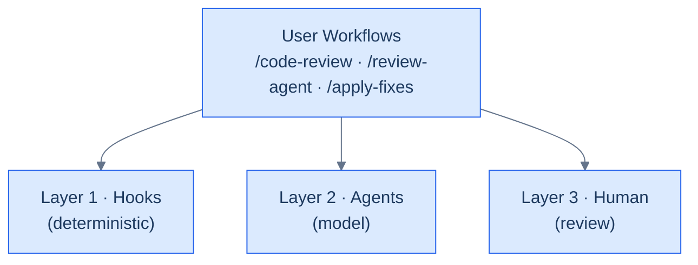

# Eval System for Code Review Agents

This document describes how the evaluation system ensures quality and consistency
across the code-review agent toolkit.

The system follows recommendations from Anthropic's
[Demystifying Evals for AI Agents](https://www.anthropic.com/engineering/demystifying-evals-for-ai-agents):
use deterministic (code-based) graders for everything they can handle, use
model-based graders only for what genuinely requires judgment, and calibrate
both against human review.

**On this page:** [Two sets of test cases](#two-sets-of-test-cases) ·
[Architecture](#architecture) · [Grader Layers](#grader-layers) ·
[Workflows](#workflows) ·
[How Hooks and Agents Complement Each Other](#how-hooks-and-agents-complement-each-other) ·
[Eval Compliance](#eval-compliance) · [Eval Fixtures](#eval-fixtures) ·
[Adding a New Agent](#adding-a-new-agent). The real-session trend digest lives
in [`session-review.md`](session-review.md).

## Two sets of test cases

This document covers the **deterministic detection fixtures** (`evals/expected/`):
does a *review agent* catch a code issue? These are graded automatically by
`scripts/eval_grade.py` and checked in CI via `--check-corpus`.

A second, complementary set grades **behavior, not detection** — the
[Ownership Engineering suite](../../../evals/ownership-engineering/) — does a
*team agent or workflow skill* investigate vs. escalate, decide vs. menu, prove
vs. assert? Because that requires judgment, it is **graded by an AI judge or a
human reviewer**, lives outside `evals/expected/` so it never enters the
deterministic gate, and its freshness is tracked by a staleness warning
(`scripts/oe_scoring_staleness.py`) that flags any subject or fixture whose inputs
changed since they were last scored. See that suite's `README.md` for the run
procedure.

## Architecture



## Grader Layers

### Layer 1: Deterministic (hooks)

Fast, free, deterministic checks that run automatically via PostToolUse hooks:

| Hook | What it checks |
| ---- | ------------- |
| `js_fp_review.py` | Array mutations, global state mutations, Object.assign, parameter mutations |
| `token_efficiency_review.py` | File length >500 lines, CLAUDE.md >5000 chars, function length >50 lines |
| `eval_compliance_check.py` | Agent/skill file structure, output format, severity levels |

Hooks are **advisory only** — they warn but never block. They catch mechanical
issues cheaply before the model-based agents spend tokens on full analysis.

### Layer 2: Model-based (agents)

Specialized agents that require LLM judgment. The full roster — with counts, focus areas, and model tiers — is documented in [`agent_info.md`](agent_info.md). Agents with eval fixture coverage:

| Agent | Focus |
| ----- | ----- |
| test-review | Test quality, coverage, assertion quality |
| structure-review | SRP, DRY, coupling, organization |
| naming-review | Naming clarity, conventions, magic values |
| domain-review | Business logic placement, boundary violations |
| complexity-review | Cyclomatic complexity, nesting, function size |
| claude-setup-review | CLAUDE.md completeness and accuracy |
| token-efficiency-review | Token optimization (full analysis beyond hook) |
| security-review | Injection, auth, data exposure, crypto |
| js-fp-review | Mutation detection (full analysis beyond hook) |
| svelte-review | Svelte reactivity, closure state leaks, store subscriptions |

Each agent outputs a structured result:

```json
{
  "agentName": "<name>",
  "status": "pass|warn|fail|skip",
  "issues": [
    {
      "severity": "error|warning|suggestion",
      "file": "<path>",
      "line": 0,
      "message": "<description>",
      "suggestedFix": "<fix>"
    }
  ],
  "summary": "<summary>"
}
```

### Layer 3: Human review

The user reviews agent findings and decides which fixes to apply. The
`/apply-fixes` command automates fix application but the user controls which
correction prompts are included.

## Workflows

### `/code-review` — Full review

See [Code Review Process](code-review-process.md) for the full nine-step pipeline: target selection, pre-flight gates, static analysis pre-pass, parallel agent dispatch, ACCEPTED-RISKS suppression, health scoring, the auto-fix loop (up to 5 iterations), correction prompts, and the `.review-passed` gate file.

### `/review-agent <name>` — Single agent

```text
Files → Agent Definition → Review → Result
```

1. Load agent definition from `agents/<name>.md`
2. Determine target files
3. Run review following agent instructions
4. Report findings

### `/apply-fixes <dir>` — Fix application

```text
Prompts → Repo Rules → Apply Fix → Validate → Report
```

1. Load correction prompt JSON files from directory
2. Load repository rules (CLAUDE.md, .clinerules, etc.)
3. Apply each fix respecting repo conventions
4. Run validation (lint/build/tests) after each fix
5. Report results (applied, failed, validation failed)

## How Hooks and Agents Complement Each Other

The hooks (`js_fp_review.py`, `token_efficiency_review.py`) provide instant
feedback on the most common, mechanically detectable issues. The corresponding
agents (`js-fp-review`, `token-efficiency-review`) provide deeper analysis that
requires LLM judgment — for example, understanding whether a mutation is
intentional based on surrounding context, or whether a long function is
justified by its complexity.

```text
Hook (instant, free)          Agent (thorough, costs tokens)
─────────────────────         ──────────────────────────────
.push() detected              Is the push on a local copy?
file >500 lines               Is the file a generated file?
Object.assign(obj, ...)       Is obj freshly created above?
```

## Eval Compliance

Two mechanisms ensure new agents and skills follow patterns:

### `/agent-audit` skill (manual)

Reads every agent, skill, and hook file and checks for:

- Structured output format
- Severity definitions
- Detection rules and scope boundaries
- Numbered steps and argument parsing
- Advisory-only hook behavior

Outputs a compliance report with PASS/WARN/FAIL per item.

### `eval_compliance_check.py` hook (automatic)

Fires on Write/Edit to agent or skill files. Provides real-time advisory
warnings when:

- A review agent is missing output format or severity definitions
- A skill is missing numbered steps or argument parsing
- A review-related skill has no report section

## Eval Fixtures

The `evals/` directory contains a test corpus for validating agent accuracy:

```text
evals/
├── fixtures/           # 54+ code samples (checked in)
│   ├── fp-*.ts         # js-fp-review (6 files)
│   ├── sec-*.ts        # security-review (5 files)
│   ├── test-*.test.ts  # test-review (6 files)
│   ├── cx-*.ts         # complexity-review (5 files)
│   ├── nm-*.ts         # naming-review (5 files)
│   ├── st-*.ts         # structure-review (5 files)
│   ├── dm-*.ts         # domain-review (5 files)
│   ├── te-*.md/.ts     # token-efficiency-review (5 files)
│   ├── sv-*.svelte.ts  # svelte-review (8 files)
│   ├── cs-*/           # claude-setup-review (4 directories)
│   └── tlg-*.md        # test-design-advisor behavior pre-gates (11 files)
├── expected/           # Reference solutions (checked in)
│   └── <fixture-stem>.json
├── transcripts/        # Auto-created by runner (gitignored)
└── reports/            # Auto-created by runner (gitignored)
```

Each fixture is a small (20-80 line), focused code sample with a known-good or
known-bad pattern. Reference solutions define expected status, issue count ranges,
severity ranges, and keyword checks.

### Reference solution schema

```json
{
  "fixture": "fp-array-mutations.ts",
  "description": "Array mutations js-fp-review should catch",
  "applicableAgents": ["js-fp-review"],
  "agents": {
    "js-fp-review": {
      "expectedStatus": "fail",
      "issueCount": { "min": 3, "max": 6 },
      "severities": { "error": { "min": 1, "max": 3 } },
      "mustMention": ["push", "sort"]
    }
  }
}
```

### Advisory-skill fixtures (gate firing)

Most fixtures grade a **review agent** by its `status/issues[]` JSON. Advisory
skills (e.g. `test-design-advisor`) don't emit that shape — they emit a report
with a *Pyramid placement* table. The `tlg-*` corpus grades the skill's
**behavior pre-gates** (issue #80) by declaring `applicableSkills` and a `skills`
block instead of `applicableAgents`/`agents`:

```json
{
  "fixture": "tlg-05-htmx-swap-mutation",
  "description": "Gate C — HTMX swap over a server state mutation",
  "applicableSkills": ["test-design-advisor"],
  "skills": {
    "test-design-advisor": {
      "expectedGates": ["C"],
      "expectedLayers": ["E2E"],
      "mustMention": ["REQUIRED", "browser", "cd-test-architecture"],
      "mustNotMention": []
    }
  }
}
```

`/agent-eval` drives the skill against each fixture and grades the Gate column +
recommended layers + keyword checks (see the command's Step 4). This replaces the
manual walk-through that `evals/fixtures/test-layer-gates.md` recorded for #80 —
re-run it with `/agent-eval --skill test-design-advisor`. `expectedGates` uses the
gate vocabulary `A`/`B`/`C`/`D`/`redundancy`/`ambiguity` (or `[]` for "no gate
fires"); `expectedLayers` uses the `test-pyramid.md` vocabulary.

### `/agent-eval` command

Run agents and skills against fixtures and grade results:

```bash
/agent-eval                                  # run everything against all fixtures
/agent-eval --agent js-fp-review             # run one review agent
/agent-eval --skill test-design-advisor      # run the gate-firing (tlg-*) corpus
/agent-eval --fixture fp-array-mutations.ts  # run one fixture
/agent-eval --trials 3                       # multi-trial with pass@k scoring
```

The runner resolves the toolkit root via symlink (for installed projects) and
saves transcripts for trend analysis. It detects eval saturation when 3
consecutive runs produce identical grades.

## Adding a New Agent

1. Create `agents/<name>.md` with:
   - JSON output format (status, issues, summary)
   - Severity definitions (error, warning, suggestion)
   - Detection rules and thresholds (inline, not in a config file)
   - File scope (which file types the agent applies to)
   - Scope boundaries (what to ignore)

2. Optionally add a hook in `hooks/<name>.py` for deterministic checks

3. Run `/agent-audit` to verify compliance

4. Add eval fixtures in `evals/fixtures/` (2-3 pass, 2-3 fail) and reference
   solutions in `evals/expected/`

5. Run `/agent-eval --agent <name>` to validate accuracy

## Session-review trend digest (#129)

`/session-review` appends one metrics-only record per run to the append-only
trend stream `metrics/session-digest.jsonl` (deliberately left bare —
/session-review's own scratch-state writer is out of scope for the #1406
`.claude/`-scoped artifact migration), the real-session counterpart to the
self-reported `.claude/metrics/*-task-log.jsonl` streams. The `session-digest/v1` record
schema and the `/harness-audit` join are documented canonically in
[`session-review.md`](session-review.md#trend-persistence-129).
