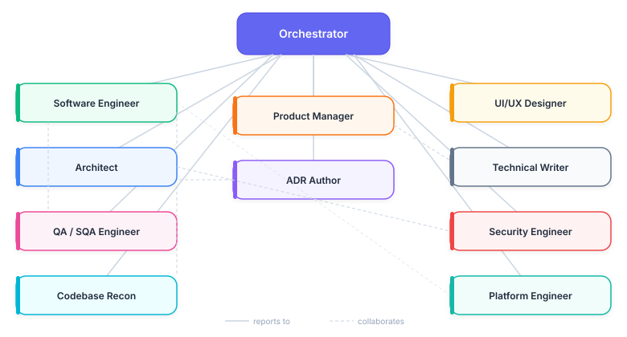

# Team Organization

This document is a visual index of the agent team. For behavioral details of each agent, see [Agents](agent_info.md). For orchestration mechanics, see [Architecture](agent-architecture.md).

## Team Agents

The Orchestrator sits at the root and routes every request to one or more of the ten team agents based on task classification. Only the Orchestrator spans phases; the other agents are loaded on demand when their phase begins and unloaded via summarization before the next phase starts. Full roster: [Agents → Team Agents](agent_info.md#team-agents).

## Review Agent Dispatch (Phase 3 Inline Checkpoints)

The Orchestrator selects review agents based on what changed in each unit of work. Language-agnostic agents (doc-review, arch-review, claude-setup-review, token-efficiency-review) always run; language-specific agents run only when matching file types are present. Full list of review agents and their scopes: [Agents → Review Agents](agent_info.md#review-agents).

## Special-purpose review agents

`progress-guardian` is a process gate-keeper, not a code reviewer — it is not in the standard review-dispatch fan-out above. It tracks plan-step completion and commit discipline, and is invoked by its owning orchestrator, never by `/code-review`.

`/test-improve` does **not** use a separate phase-gate agent; its per-phase progress files under `.claude/memory/test-improve/<slug>/phase-<n>.md` and its end-of-phase review loop (Phase 5 and Phase 7) carry the equivalent evidence contract.
