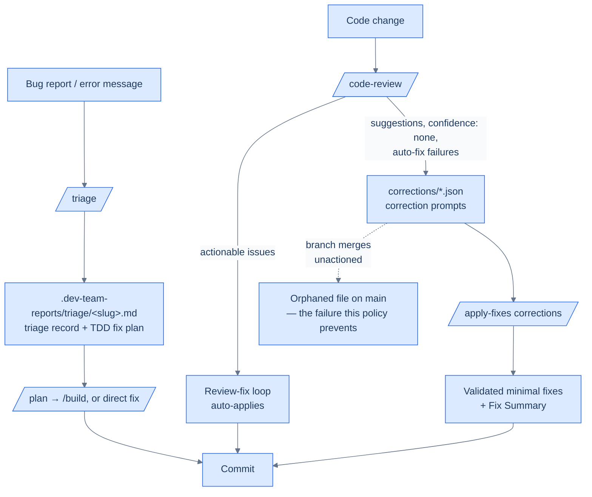

# Triage Workflow: Discovery to Applied Fix

How a defect or review finding travels from discovery to an applied fix. The
pieces are three individual skills; this document is the lifecycle that
connects them.

> **Authoritative sources**: the skill specs at
> [`skills/triage/SKILL.md`](../skills/triage/SKILL.md),
> [`skills/code-review/SKILL.md`](../skills/code-review/SKILL.md), and
> [`skills/apply-fixes/SKILL.md`](../skills/apply-fixes/SKILL.md). This
> document is a reader-friendly walkthrough; where it and a skill spec
> disagree, the spec wins.

**On this page**: [Lifecycle at a glance](#the-lifecycle-at-a-glance) · [1. Intake](#1-intake--when-to-reach-for-triage) · [2. Investigation](#2-investigation--root-cause-before-recording) · [3. The triage record](#3-the-triage-record) · [4. Review-corrections flow](#4-the-review-corrections-flow) · [5. `/apply-fixes` flow](#5-the-apply-fixes-flow) · [6. Ownership of leftover corrections](#6-ownership-of-leftover-corrections) · [7. A worked example](#7-a-worked-example)

## The lifecycle at a glance

Two entry points feed one fix pipeline:

- **A reported bug** enters through [`/triage`](../skills/triage/SKILL.md),
  which investigates hands-off and writes a **triage record** to
  `.dev-team-reports/triage/<slug>.md` with a TDD fix plan. It deliberately does **not** fix
  the bug — the record hands off to `/plan`/`/build` or a direct fix.
- **A review finding** enters through
  [`/code-review`](../skills/code-review/SKILL.md), whose fix loop
  auto-applies actionable issues and emits everything else as **correction
  prompts** — self-contained JSON files in `corrections/` — which
  [`/apply-fixes`](../skills/apply-fixes/SKILL.md) later consumes.



## 1. Intake — when to reach for `/triage`

Use `/triage` when a defect arrives as a *report*: a bug description, an
error message, a failing behavior someone wants investigated — anything
phrased like "triage this", "investigate and write it up", or where you want
a hands-off investigation that produces an actionable record instead of an
immediate code change.

Go straight to a fix (skip `/triage`) when the root cause is already known
and the fix is small enough to implement immediately — a triage record adds
no value if you would write it and then act on it in the same breath.

**The one-question capture rule.** `/triage` takes the bug description from
its arguments or the conversation. If no description is available, it asks
EXACTLY one question — `What's the problem you're seeing?` — and stops. If a
description *is* given, it asks nothing and starts investigating immediately.
In practice: give the symptom, the error text, or the reproduction in the
invocation and the entire investigation runs without further interaction.

## 2. Investigation — root cause before recording

`/triage` runs as a worker under three constraints:

1. **Investigate and record; do not fix the bug.** The worker's boundary is
   the record. Fixing happens later, under `/plan`/`/build` or a direct fix,
   where tests and review gates apply.
2. **Find root cause before recording; do not record on symptoms alone.**
   The record exists to make the fix mechanical — a symptom description
   without a cause is not a triage record.
3. **Be concise.** Chat output is two lines (see
   [the triage record](#3-the-triage-record) below), never the full record
   body.

The investigation applies the systematic debugging protocol from
[`skills/systematic-debugging/SKILL.md`](../skills/systematic-debugging/SKILL.md):

1. **Reproduce** — run the failing test or trigger the error.
2. **Investigate** — trace data flow, check recent changes, find working
   reference code.
3. **Root cause** — form and test a hypothesis.

Deep codebase exploration is delegated to an `Explore` sub-agent: related
source files and dependencies, existing tests (covered vs missing), recent
changes to affected files (`git log`), error handling in the code path, and
similar patterns elsewhere that work correctly.

## 3. The triage record

The record is written to `.dev-team-reports/triage/<slug>.md` — YAML frontmatter (`id`,
`created`, `status: open`) followed by four sections:

| Section | Contents |
| --------- | ---------- |
| **Problem** | Actual behavior, expected behavior, reproduction steps |
| **Root Cause Analysis** | The code path involved, why it fails, contributing factors — described as *modules and behaviors, not file paths*, so the record survives refactors |
| **TDD Fix Plan** | Ordered RED-GREEN cycles (at least one), each a vertical slice: a specific test capturing the broken/missing behavior, then the minimal change to pass it, plus any post-green REFACTOR cleanup |
| **Acceptance Criteria** | Root cause addressed (not just symptom), new tests pass, existing tests pass, no regressions |

If no root cause was determined, the TDD Fix Plan body is exactly
`Root cause not determined — manual investigation required` — the record
still captures the investigation, but flags itself as incomplete.

**Slug and collisions.** The slug is derived from the bug title by a
deterministic normalization (lowercase, ASCII-only, hyphens, ≤ 60 chars, no
split words; empty result falls back to `triage-YYYYMMDD`). If
`.dev-team-reports/triage/<slug>.md` already exists, `-2`, `-3`, … up to `-99` is appended —
an existing record is **never overwritten**. If `.dev-team-reports/triage/` cannot be written
at all, the same content goes to a temp file and to chat so nothing is lost.

**Why issue-tracker independent?** The record is a plain file in the repo,
so it works with no tracker configured, travels with branches and worktrees,
and can be pasted into any tracker later. Nothing in the workflow depends on
GitHub, Jira, or anything else being reachable.

**Handoff.** Chat output is exactly two lines: the record path
(`triage-record: .dev-team-reports/triage/<slug>.md`) and a root-cause summary of at most 120
characters. From there:

- **Substantial fix** → feed the record to
  [`/plan`](../skills/plan/SKILL.md); each RED-GREEN cycle maps to a plan
  step, and [`/build`](../skills/build/SKILL.md) executes it under TDD.
- **Small fix** → implement the cycles directly, in order — the plan is
  already TDD-shaped.

## 4. The review-corrections flow

[`/code-review`](../skills/code-review/SKILL.md) classifies every finding by
severity and confidence. The rubric decides what the **fix loop**
auto-applies and what is report-only:

| Severity | Confidence | Actionable? |
| ---------- | ------------ | ------------- |
| error or warning | high or medium | **Yes** — auto-applied by the fix loop |
| error or warning | none | No — report only (human judgment) |
| suggestion | any | No — report only, never auto-applied |

After the report, `/code-review` writes one **correction prompt** per
remaining issue — suggestion-severity findings, issues whose auto-fix failed,
and anything else the loop did not resolve — as JSON files in `corrections/`.
Each prompt carries `priority`, `confidence`, `category` (the reviewing agent),
`instruction`, `context`, and `affectedFiles`; the full field schema is in
[`skills/code-review/output-format.md`](../skills/code-review/output-format.md#correction-prompt-json).

Severity maps to priority: error→high, warning→medium, suggestion→low.
Correction prompts are only generated for `confidence: high` or
`confidence: medium` findings — `confidence: none` findings appear in the
review report only and must be resolved by a human.

Each prompt is self-contained: it names the reviewing agent, the fix
instruction, and the affected files, so it can be actioned in a later
session with no memory of the review that produced it.

## 5. The `/apply-fixes` flow

[`/apply-fixes`](../skills/apply-fixes/SKILL.md) consumes a corrections
directory and applies each prompt as a minimal, individually-validated fix:

```bash
/apply-fixes corrections/                # apply everything
/apply-fixes corrections/ --dry          # preview without changing anything
/apply-fixes corrections/ --skip-tests   # skip per-fix test runs
/apply-fixes corrections/ --repo <path>  # target a different repository
```

Also available: `--skip-build`, `--skip-lint`, `--verbose`.

It first loads the target repository's rules (`CLAUDE.md`, `.clinerules`,
`.claude/rules/index.md`, `CONTRIBUTING.md`), then processes prompts sorted
by priority (high first), then confidence (high before medium):

- **`confidence: high`** — auto-applied.
- **`confidence: medium`** — the suggested diff is shown and the user
  confirms (`y/n/skip`); declined prompts are recorded as "skipped by user".
  Running non-interactively (e.g. CI), medium is treated as high.

Three constraints govern every fix:

1. **Minimal fix** — apply exactly what the instruction says; no
   refactoring or improvement beyond it.
2. **Validate after each fix** — lint, build, and tests run after every
   individual fix (unless skipped); a validation failure is reported and the
   run moves on — no cascading fix attempts.
3. **One concern per fix** — prompts are never combined or reordered.

Results are reported as a Fix Summary table (Applied / Skipped / Failed /
Validation Failed, per category), and successfully applied prompt files are
moved to a `completed/` subdirectory so a re-run does not re-apply them.

## 6. Ownership of leftover corrections

`corrections/` is a **branch-scoped working artifact**. The policy:

> **A `corrections/*.json` file must not outlive its branch unactioned.**
> Before the branch merges, its author disposes of every correction prompt
> in one of three ways — and the merged branch carries the disposition, not
> the file.

1. **Apply** — run `/apply-fixes corrections/`, review the diff, commit the
   fixes. Delete the directory (including `completed/`) before merge; the
   fix commits are the record.
2. **Defer** — file a tracking issue that carries or links the findings,
   then delete the file in the same change. The issue is now the record and
   has an assignee.
3. **Decline** — delete the file, recording why in the commit message
   (e.g. `chore: decline stale corrections — superseded by refactor #NNN`).

**If a `corrections/*.json` is found on `main` anyway**: the owner is the
author of the commit that introduced it — find them with
`git log --diff-filter=A -- corrections/<file>`. The owner's next action is
one of the three dispositions above; when the findings cannot be evaluated
quickly, default to **Defer** (file the issue, delete the file). Leaving the
file in place "for later" is not a disposition — it is the failure mode this
policy exists to prevent.

That failure mode is real: the Issue-537 branch review left
`corrections/issue-537-gherkin-persistence-suggestions.json` (14 findings,
including two with correctness teeth) sitting on `main` for months — no
tracking issue, nothing pointing at it — until it was noticed by accident
and removed.

## 7. A worked example

One suggestion-severity finding, traced end to end. The subject is a real
finding from the Issue-537 branch review (shown here in the canonical
one-file-per-issue prompt shape).

**Discovery.** During `/code-review` on the branch, `performance-review`
reports that a directory-exclusion list misses Maven's `target/` — copied
`.feature` resources in Maven builds would skew a detection signal. Severity
`suggestion`, confidence `high`.

**Classification.** Per the rubric, suggestion severity is report-only — the
fix loop does not touch it. The finding appears in the review report tagged
`[suggestion]`.

**Correction prompt.** Step 8 of `/code-review` writes it to `corrections/`:

```json
{
  "priority": "low",
  "confidence": "high",
  "category": "performance-review",
  "instruction": "Extend VENDORED_DIR_NAMES with target, __pycache__, .tox, .next, out, coverage — target/ also matters for correctness. Add a fixture test per new exclusion.",
  "context": "VENDORED_DIR_NAMES in plugins/dev-team/scripts/detect_bdd_convention.py",
  "affectedFiles": ["plugins/dev-team/scripts/detect_bdd_convention.py"]
}
```

**Applying.** The branch author runs:

```bash
/apply-fixes corrections/ --dry    # preview: 1 prompt, high confidence, auto-apply
/apply-fixes corrections/
```

`/apply-fixes` reads the repository rules, applies the minimal edit (extend
the exclusion list, add the fixture tests — nothing more), then runs lint,
build, and tests.

**Validation and commit.** Tests pass; the Fix Summary reports
`Total: 1 | Applied: 1`, and the prompt file moves to
`corrections/completed/`. The author reviews `git diff`, commits the fix
conventionally, and deletes `corrections/` before merging — disposition
**Apply**, leaving nothing to orphan.

## Related documents

- [Code Review Process](code-review-process.md) — the full `/code-review`
  pipeline that produces correction prompts
- [Top-level Workflows](workflows.md) — the multi-phase orchestrators
  (`/ship`, `/test-improve`) that embed `/code-review` and `/apply-fixes`
- [Skills reference](skills.md) — catalog of all slash commands
- [`skills/triage/SKILL.md`](../skills/triage/SKILL.md),
  [`skills/apply-fixes/SKILL.md`](../skills/apply-fixes/SKILL.md),
  [`skills/code-review/output-format.md`](../skills/code-review/output-format.md)
  — the authoritative specs
